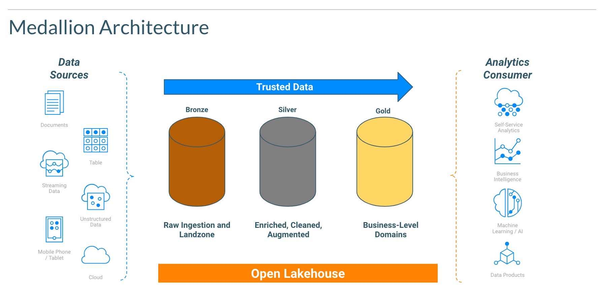
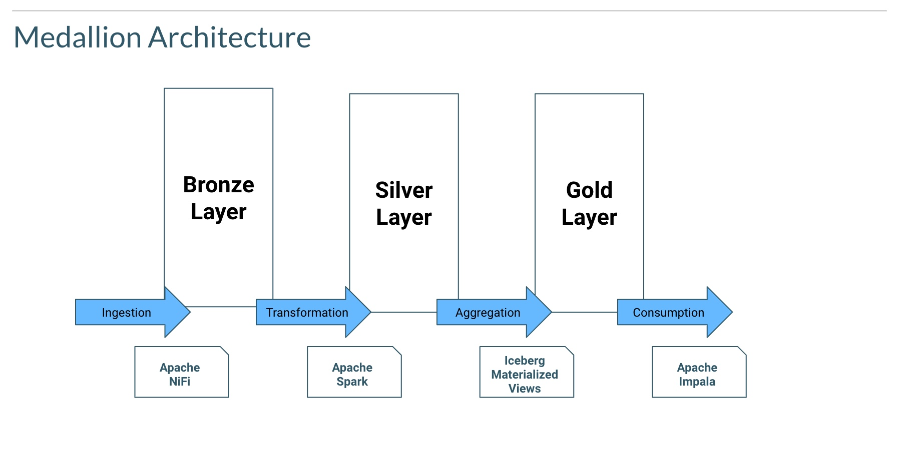

#  Best Practice 01 # - Medallion Architecture

## Medallion Architecture at Cloudera

## IceTip 

Leverage Medallion Architecture pattern to simplify the maintenance of the different stages of the data that will be ingested into the Lakehouse.
Keep the data format closer to the origin data source in the Bronze layer and perform the additional transformations and enrichment for the upper layers. 
Materialized Views can also be leveraged for the Gold layer as a mechanism to facilitate multiple table aggregation creation and maintenance. 
