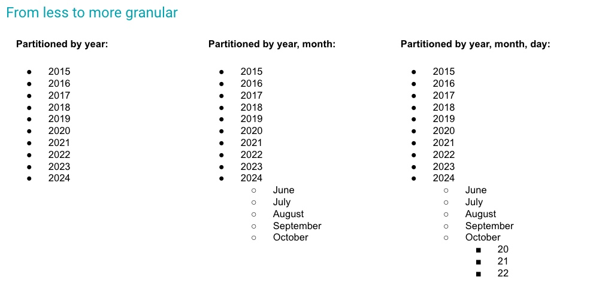

#  Best Practice 05 - Table Evolution




## Table structure, partitioned by year:

```sql
CREATE TABLE transaction (id INT, time TIMESTAMP, ...) 
PARTITIONED BY YEARS(time);
```

## Adding new partitions. First, break down by month, then by day:

```sql
ALTER TABLE transaction ADD PARTITION FIELD MONTH(time)
```

```sql
ALTER TABLE transaction ADD PARTITION FIELD DAY(time)
```

## IceTip
Monitor the amount of data ingested in each partition, and the query’s patterns, to define when a new partition is needed to keep consumption jobs performant. 
Leverage in-place partition evolution to break down data into more granular partitions easily. 

End-user doesn’t need to be aware of the partition changes, even changing how to query the table.
