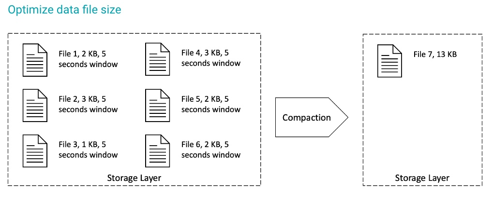

#  Best Practice 04 - Data Compaction

## 1. Strategy

- binPack
- order
- order

## 2. Filters

Run compaction on specific parts of the data

## 3. Options

- partial-progress-enabled
- rewrite-job order
- target-file-size-bytes,
- and so much more...

## 4. Automation

CDE => Spark job orchestrated by Airflow

## IceTip

Accordingly to the row-level mutations strategy mutation defined for the Iceberg table, data compactions should be run more or less frequently. 
As COW already creates new files with the changes, this strategy will eventually require less frequent compactions. 
On the other hand, MOR creates delta files to record the changes, and to keep good query performance, compactions will create new files, therefore, better access performance.
