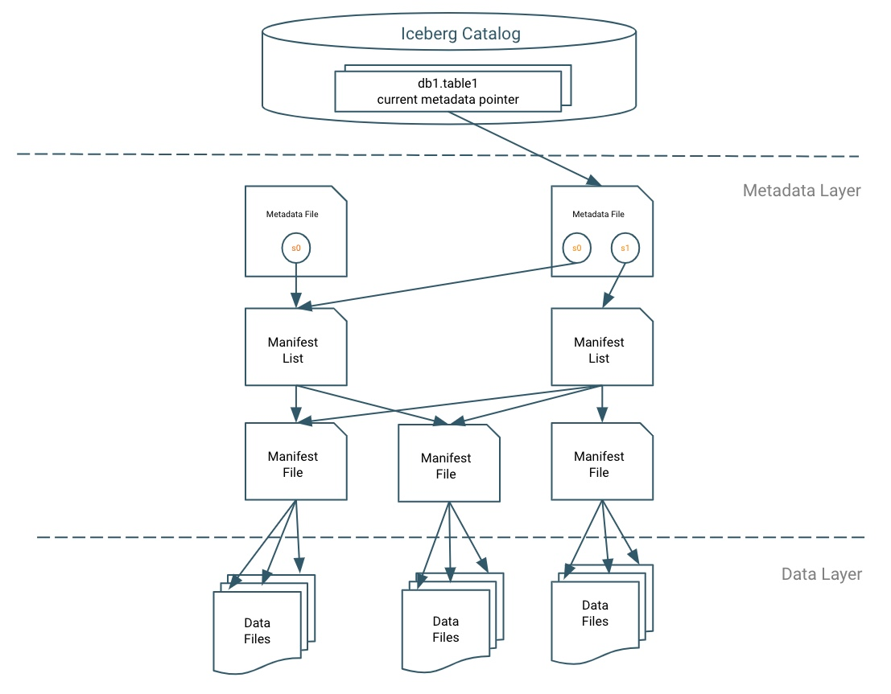
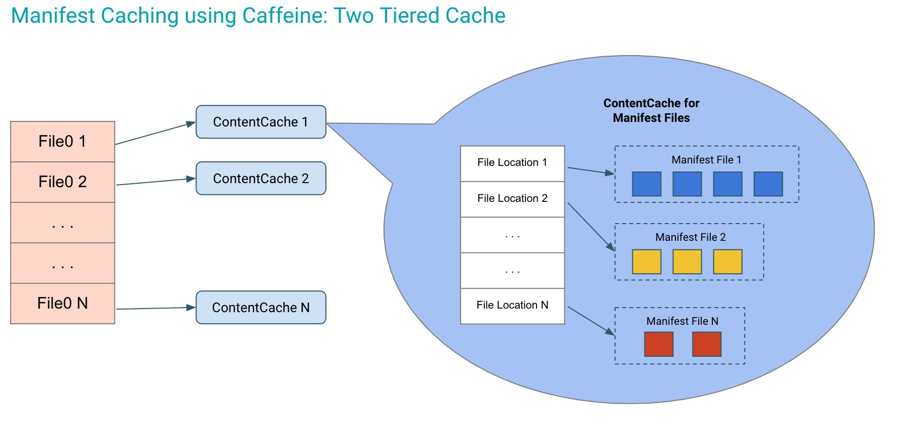

# Best Practice 10 - Metadata Caching

## Let's dive into the Manifest File

## IceTip
Enabling the manifest caching feature helps to reduce repeated reads of small Iceberg manifest files from remote storage by Impala Coordinators and Catalogd.
