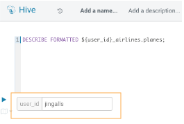
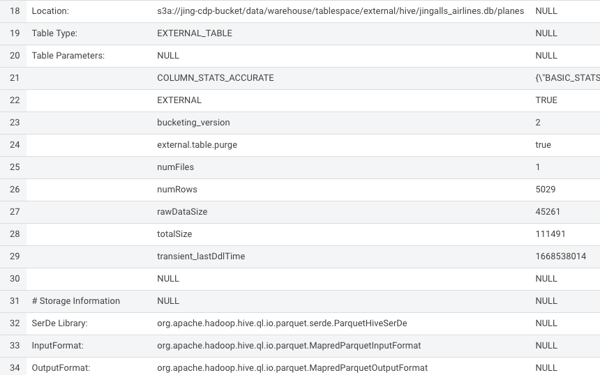
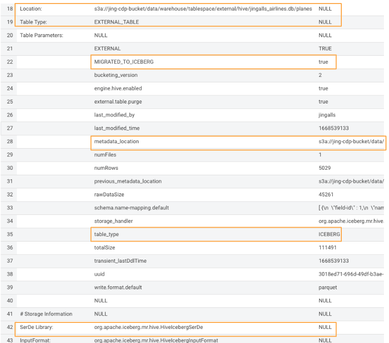

# Migrate Existing Tables to Iceberg Tables

**Migrate table feature (in-place)**

- Execute the following in HUE for Hive VW, In the “user\_id” parameter box enter your user id 

```
    DESCRIBE FORMATTED ${user_id}_airlines.planes;
```



- In the output - look for the following properties Table Type, and SerDe Library




- Execute the following

```
    ALTER TABLE ${user_id}_airlines.planes
    SET TBLPROPERTIES ('storage_handler'='org.apache.iceberg.mr.hive.HiveIcebergStorageHandler');

    DESCRIBE FORMATTED ${user_id}_airlines.planes;
```

- In the output - look for the following (see image with highlighted fields) key values: Table Type, Location (location of where table data is stored), SerDe Library, and in Table Parameters look for properties MIGRATE\_TO\_ICEBERG, storage\_handler, metadata\_location, and table\_type

  - Location - Data is stored in cloud storage in this case S3 in the same location as the Hive Table Format

  - Metadata\_location - Since there is no need to regenerate data files with in-place table migration, you save time generating Iceberg tables. Only metadata is regenerated, which points to source data files.  Removes Hive Metastore as bottleneck.

  - Table\_type - indicates “ICEBERG” table format

  - Storage\_handler & SerDe Library - indicate what Serializer/Desearializer to use when reading/writing data in this case the “HiveIcebergSerDe”




**Create Table as Select (CTAS) - create new table**

- Execute the following lines in HUE for the Hive VW

```
    drop table if exists ${user_id}_airlines.airports;

    CREATE EXTERNAL TABLE ${user_id}_airlines.airports
    STORED BY ICEBERG AS
      SELECT * FROM ${user_id}_airlines_csv.airports_csv;

    DESCRIBE FORMATTED ${user_id}_airlines.airports;
```

- In the output - look for table\_type in the Table Parameters section to ensure that the table is in “ICEBERG” format

