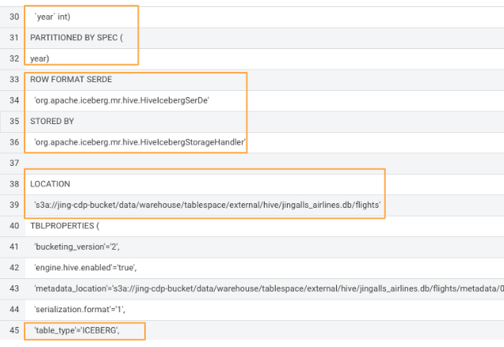

# Create Iceberg Table Feature

**Create table (partitioned) feature**

- Execute the following lines in HUE for the Hive VW

```
    drop table if exists ${user_id}_airlines.flights;

    CREATE EXTERNAL TABLE ${user_id}_airlines.flights (
     month int, dayofmonth int, 
     dayofweek int, deptime int, crsdeptime int, arrtime int, 
     crsarrtime int, uniquecarrier string, flightnum int, tailnum string, 
     actualelapsedtime int, crselapsedtime int, airtime int, arrdelay int, 
     depdelay int, origin string, dest string, distance int, taxiin int, 
     taxiout int, cancelled int, cancellationcode string, diverted string, 
     carrierdelay int, weatherdelay int, nasdelay int, securitydelay int, 
     lateaircraftdelay int
    ) 
    PARTITIONED BY (year int)
    STORED BY ICEBERG 
    STORED AS PARQUET;

    SHOW CREATE TABLE ${user_id}_airlines.flights;
```

- In the output - look for the following (see highlighted fields)




Continue with 1 of the following
- Module 03 - Loading Data > load_iceberg_tbl_SQL.md
- Module 03 - Loading Data > ???
- Module 13 - load_new_data_to_flights_DF.md

