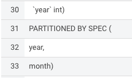
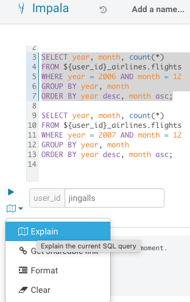
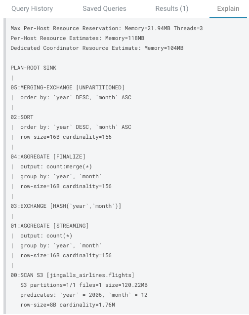
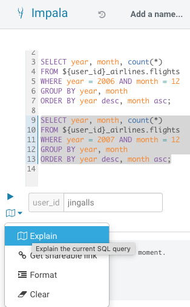
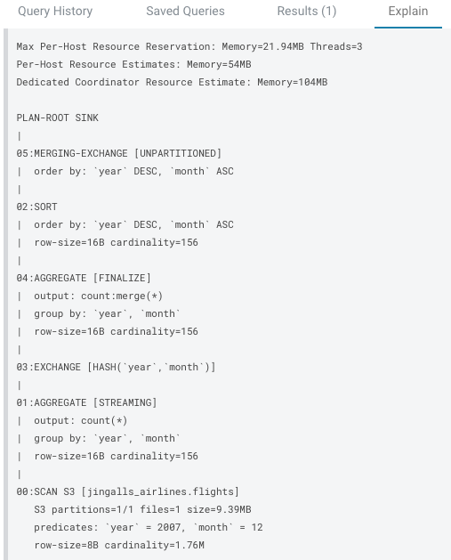
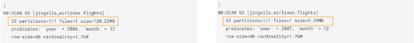

# Partition Evolution

In this Demo, we’ll just be exploring Partition Evolution.

**In-place Table Evolution feature**

- Execute the following lines in HUE for the Hive VW 

```
    ALTER TABLE ${user_id}_airlines.flights
    SET PARTITION spec ( year, month );
```

- **Note**: this ALTER TABLE happens in-place and no data is manipulated existing data remains indexed by Year

* Execute the following

```
    SHOW CREATE TABLE ${user_id}_airlines.flights;
```

- In the output - look for the Partition Spec to see the table is now partitioned by Year & Month



- Execute the following lines in HUE for the Hive VW to load additional data into the flights table to leverage the new partitioning strategy

```
    INSERT INTO ${user_id}_airlines.flights
     SELECT * FROM ${user_id}_airlines_csv.flights_csv
     WHERE year = 2007;
```

**Impala Query Iceberg Tables - engine agnostic**

- First of all let’s switch to take advantage of the performance capabilities of Impala to query data for this part of the Runbook.

- Execute the following in HUE for Impala VW, In the “user\_id” parameter box enter your user id

```
    -- Typical analytic query patterns that need to be run

    -- RUN EXPLAIN PLAN ON THIS QUERY
    SELECT year, month, count(*) 
    FROM ${user_id}_airlines.flights
    WHERE year = 2006 AND month = 12
    GROUP BY year, month
    ORDER BY year desc, month asc;

    -- RUN EXPLAIN PLAN ON THIS QUERY; AND COMPARE RESULTS
    SELECT year, month, count(*) 
    FROM ${user_id}_airlines.flights
    WHERE year = 2007 AND month = 12
    GROUP BY year, month
    ORDER BY year desc, month asc;
```

- Highlight the first “SELECT” statement to the “;” and click on theand select EXPLAIN.  Scroll down to the bottom of the Explain tab

               

- Highlight the second “SELECT” statement to the “;” and click on theand select EXPLAIN.  Scroll down to the bottom of the Explain tab

              

- If you remember from an early query we ran, you saw that the counts for each year are fairly uniform.  But since we had 2 different partitioning strategies when we compare the Explain Plans we can see that the Query for year=2006 (uses the year partition still), so we see that this query scans 1 partition that is \~120MB even though we also are filtering on month.  However, the Query for year=2007 (uses the year, month partition) only has to scan 1 month of data so it also only scans 1 partition, but the month partition in this case is only \~9MB.  Major Performance Boost.

**Query for year=2006**                                 **Query for year=2007**


