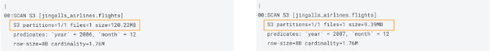

# Partition Evolution - Spark DataFrame

In this Demo, we’ll just be exploring in-place Partition Evolution.

**In-place Table Evolution feature**

- Execute the following lines in a CDE Session 

```
from pyspark.sql.functions import col

# Variables - replace <user_id> with your user id
user_id = "<user_id>"
csv_database_name = user_id + "_airlines_csv"
odl_database_name = user_id + "_airlines"

# CHECK TABLE FORMAT - before in-place partition evolution (will return 'year')
spark_df = spark.sql(f"DESCRIBE FORMATTED {odl_database_name}.flights")
spark_df.filter(spark_df.col_name.isin(['Part 0', 'Part 1', 'Part 2'])).show()

# EVOLVE PARTITOIN IN-PLACE & WRITE DATA USING NEW PARTITION (single DF statement) - add another column to partition to improve performance
spark.sql(f"ALTER TABLE {odl_database_name}.flights ADD PARTITION FIELD month").show()


# CHECK TABLE FORMAT - after partition evolution (will return 'year', 'month')
spark_df = spark.sql(f"DESCRIBE FORMATTED {odl_database_name}.flights")
spark_df.filter(spark_df.col_name.isin(['Part 0', 'Part 1', 'Part 2'])).show()


# READ 2007 DATA
spark_df = spark.read.table(f"{csv_database_name}.flights_csv").where(col("year").isin([2007]))

# WRITE 2007 DATA TO TABLE
spark_df.writeTo(f"{odl_database_name}.flights").using("iceberg").append()


# CHECK RESULTS
spark.read.table(f"{odl_database_name}.flights").groupBy(col("year")).count().orderBy(col("year"), ascending=False).show()

```

- In the output - look for the Partition Spec to see the table is now partitioned by Year & Month

- **Note**: this ALTER TABLE happens in-place and no data is manipulated existing data remains indexed by Year


**Impala Query Iceberg Tables - engine agnostic**

- First of all let’s switch to Impala to query data for this part of the Runbook.

- "Run Explain Plan" for the following in HUE for Impala VW, In the “user\_id” parameter box enter your user id

```
-- Typical analytic query patterns that need to be run

-- RUN EXPLAIN PLAN ON THIS QUERY
SELECT year, month, count(*) 
FROM ${user_id}_airlines.flights
WHERE year = 2006 AND month = 12
GROUP BY year, month
ORDER BY year desc, month asc;

-- RUN EXPLAIN PLAN ON THIS QUERY; AND COMPARE RESULTS
SELECT year, month, count(*) 
FROM ${user_id}_airlines.flights
WHERE year = 2007 AND month = 12
GROUP BY year, month
ORDER BY year desc, month asc;
```

- Highlight the first “SELECT” statement to the “;” and click on theand select EXPLAIN.  Scroll down to the bottom of the Explain tab

               

- Highlight the second “SELECT” statement to the “;” and click on theand select EXPLAIN.  Scroll down to the bottom of the Explain tab

              

- If you remember from an early query we ran, you saw that the counts for each year are fairly uniform.  But since we had 2 different partitioning strategies when we compare the Explain Plans we can see that the Query for year=2006 (uses the year partition still), so we see that this query scans 1 partition that is \~120MB even though we also are filtering on month.  However, the Query for year=2007 (uses the year, month partition) only has to scan 1 month of data so it also only scans 1 partition, but the month partition in this case is only \~9MB.  Major Performance Boost.

**Query for year=2006**                                 **Query for year=2007**


