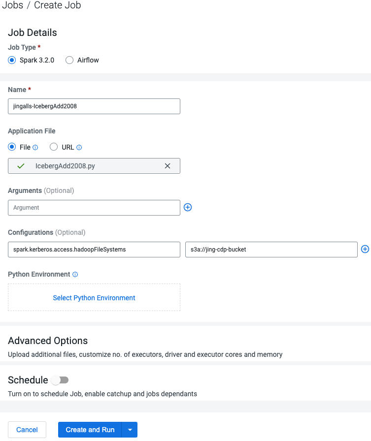
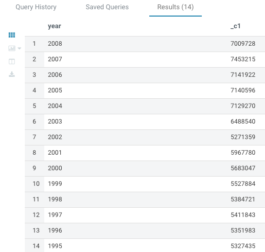

# Load an Additional Year of Data Using Spark SQL

## Overview

This submodule demonstrates how to use Apache Spark in Cloudera Data Engineering (CDE) to load an additional year of data (2008) into an Iceberg table. You will execute a Python script that reads data from a CSV file stored in AWS S3, filters the data for a specific year, and inserts it into the existing Iceberg table.

The goal is to showcase Iceberg's multi-engine capabilities, specifically highlighting Spark for data manipulation and Impala for querying the results in Cloudera Data Warehouse (CDW/Hue).

## Prerequisites

Before running this submodule, ensure that:

- You have access to a Cloudera Data Engineering (CDE) virtual cluster with Spark capabilities.
- You have set up Kerberos credentials to access AWS S3 cloud storage.
- The Iceberg table (`flights`) was created in earlier steps using CDW/Hue (Hive).
- You have installed an IDE or text editor (e.g., VS Code) to modify the Python script.

## Step-by-Step Guide

### Step 1. Prepare the Spark Script

Open a text editor (e.g., VS Code) and create a Python script that will load data from AWS S3 into the Iceberg table.

Copy the following code into your Python file, replacing `<prefix>` with your user ID.

```
#****************************************************************************
# 
#  ICEBERG (Multi-function Analytics) - LOAD DATA  into table created in CDW
#
#***************************************************************************/
from pyspark.sql import SparkSession
from pyspark.sql.functions import *
import pyspark.sql.functions as F

#---------------------------------------------------
#               CREATE SPARK SESSION
#---------------------------------------------------
spark = SparkSession.builder.appName('Ingest').getOrCreate()

#-----------------------------------------------------------------------------------
# LOAD DATA 1 YEAR (2008) FROM RAW DATA CSV FILES ON AWS S3 CLOUD STORAGE
#          A  TABLE IS ALREADY CREATED ON TOP OF THE CSV FILE
#          RUN INSERT INTO ICEBERG TABLE FROM THE RAW CSV TABLE
#
#-----------------------------------------------------------------------------------
print("JOB STARTED...")
spark.sql("INSERT INTO <prefix>_airlines.flights SELECT * FROM <prefix>_airlines_csv.flights_csv WHERE year = 2008 ")

print("JOB COMPLETED.\n\n")
```

Save the file as `IcebergAdd2008.py` in a location you can easily access.

### Step 2. Create and Run the Spark Job in CDE

1. Navigate to the CDE console and click on **View Jobs** for your virtual cluster named **<prefix>-iceberg-vc**, replacing `<prefix>` with your user ID.
2. Click **Create Job** and configure the following settings:
   - **Job Type**: Spark 3.2.0
   - **Name**: `<prefix>-IcebergAdd2008`
   - **Application File**: Upload the `IcebergAdd2008.py` script you just saved.
   - **Select Resource**: Create a new resource named `<prefix>-IcebergAdd2008`.
   - **Kerberos Configuration**: Set `spark.kerberos.access.hadoopFileSystems = s3a://<cdp-bucket>`, replacing `<cdp-bucket>` with the correct bucket name.
   
3. Click **Create and Run** to execute the job.

   

### Step 3. Monitor Job Execution

1. Go to **Job Runs** in CDE and click on the job you just submitted.
2. Review the logs and run history to confirm successful execution.

   

### Step 4. Verify the Data in CDW/Hue

Once the Spark job completes, verify that the data has been added to the Iceberg table using Impala in CDW/Hue.

1. In CDW/Hue, execute the following query to check the record count for the year 2008:
   ```
   SELECT year, count(*)
   FROM ${prefix}_airlines.flights
   GROUP BY year
   ORDER BY year desc;
   ```

2. You should see the records for the year 2008 along with data for the previous years.

   

## Conclusion

This submodule demonstrated how to use Spark in Cloudera Data Engineering to load data into an Iceberg table. You have successfully inserted data for an additional year (2008) and verified the results using CDW/Hue. This process highlights Iceberg’s multi-engine capabilities, enabling both Spark-based data manipulation and Impala querying for analysis.

## Next Steps

Continue exploring more advanced functionality with Iceberg and Spark, or return to the main module for additional exercises and insights.
