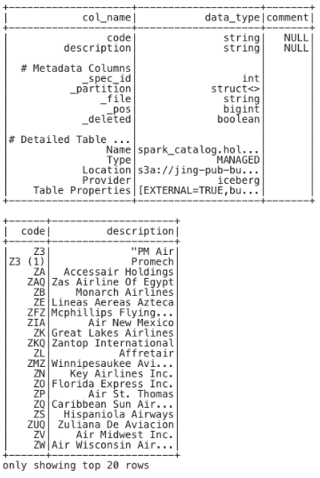
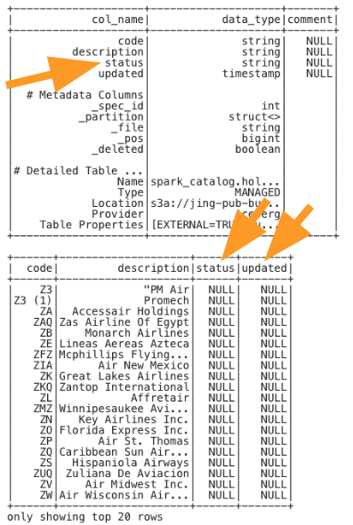
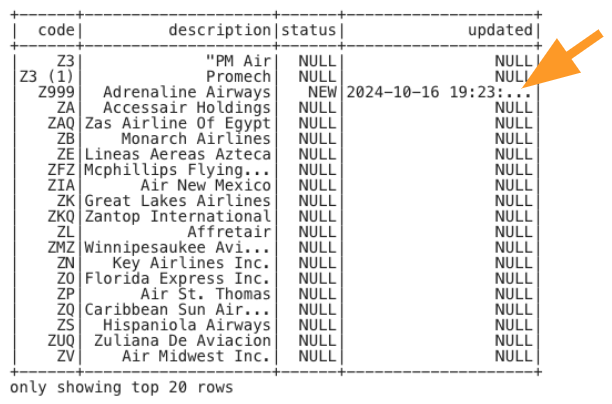

# Schema Evolution - Spark DataFrame

## Overview

In this submodule, we’ll explore in-place schema evolution using Spark DataFrames within a Cloudera Data Engineering (CDE) session. Schema evolution allows you to modify the schema of your tables with minimal data movement, providing flexibility and allowing you to keep up with the business needs/requirements.

## Prerequisites

Before starting, ensure you have:

- Access to a Cloudera Data Engineering (CDE) session.
- Proper permissions to execute Spark commands.
- Your `${prefix}` (e.g., your User ID) ready for use in the code.

## Step-by-Step Guide

### Step 1: Set Up Variables

Begin by setting up your environment variables. Replace `<prefix>` with your unique value (e.g., your User ID).

``` python
from pyspark.sql.functions import col
from pyspark.sql.functions import current_timestamp

# Variables - replace <prefix> with your prefix
prefix = "<prefix>"
odl_database_name = prefix + "_airlines"
```

### Step 2: Check Current Schema

Before evolving the schema, check the current schema of the `airlines` table. This will confirm that the table currently has 2 columns: `code`, and `description`.

``` python
# CHECK TABLE FORMAT - before in-palce schema evolution
spark_df = spark.sql(f"DESCRIBE FORMATTED {odl_database_name}.airlines")
spark_df.show()

# Query data to see data prior to evolving the schema
spark_df = spark.read.format("iceberg").table(f"{odl_database_name}.airlines").orderBy(col("code"), ascending=True)

# Filter rows where the 'code' column is greater than 'Z'
filtered_df = spark_df.filter(col("code") > "Z")

# Show the results
filtered_df.show()
```




### Step 3: Evolve the Schema In-Place

Use Spark SQL to add additonal columns (`status`, `updated`) to the table. This operation happens in-place, evolving the schema without moving any existing data.

``` python
# EVOLVE SCHEMA IN-PLACE - add columns to the schema
spark.sql(f"ALTER TABLE {odl_database_name}.airlines ADD COLUMNS(status STRING, updated TIMESTAMP)").show()
```

> **Note**: This ALTER TABLE operation happens in-place, so no data is manipulated, and the existing data remains with the current schema.


### Step 4: Verify the New Schema

After evolving the schema, verify that the table is now using the new schema.

``` python
# CHECK TABLE FORMAT - after schema evolution
spark_df = spark.sql(f"DESCRIBE FORMATTED {odl_database_name}.airlines")
spark_df.show()

# Query data to see new columns but defaulted to NULL; existing data NOT rewritten
spark_df = spark.read.format("iceberg").table(f"{odl_database_name}.airlines").orderBy(col("code"), ascending=True)

# Filter rows where the 'code' column is greater than 'Z'
filtered_df = spark_df.filter(col("code") > "Z")

# Show the results
filtered_df.show()
```



> **Note**: The output will now show additional columns, but the columns are defaulted with NULLs as values for these new columns.


### Step 5: Load and Write Data Using Spark DataFrames

To leverage the new schema, insert a row into to the `airlines` table using Spark DataFrames.

``` python
# Insert new row with NEW Columns
data = [
    ('Z999','Adrenaline Airways','NEW') 
]

columns = ['code', 'description', 'status']

# Convert data into a DataFrame
spark_df = spark.createDataFrame(data, columns)

spark_df = df.withColumn("updated", current_timestamp())

# Add new record with new schema to the table
spark_df.writeTo(f"{odl_database_name}.airlines").using("iceberg").append()
```

### Step 6: Verify the Data Load

After loading the data, run a query to verify that the data has been correctly inserted into the Iceberg table and is using the `status` and `updated` columns.

``` python
# Query data to see new column populated
spark_df = spark.read.format("iceberg").table(f"{odl_database_name}.airlines").orderBy(col("code"), ascending=True)

# Filter rows where the 'code' column is greater than 'Z'
filtered_df = spark_df.filter(col("code") > "Z")

# Show the results
filtered_df.show()
```




### Summary

You have successfully evolved the schema of your Iceberg table in-place using Spark DataFrames and demonstrated how easy and painless it is to change the schema of a table that is already loaded with data. This process allows you to maintain table to meet business requirements and as the data evolves.

## Next Steps

Having completed Module 08, you're now ready to explore more advanced features and functionalities of Iceberg tables. Here are some recommended modules to continue your learning:
  
- **[Module 09 - Security](Module%2009%20-%20Security/README.md):** Leverage Ranger to setup fine-grained access policies on Iceberg tables.

- **[Module 10 - Data Catalog](Module%2010%20-%20Data%20Catalog/README.md):** Learn how Cloudera's Data Catalog captures metadata for all of the Iceberg tables that have been created to this point.

These modules will build on the foundational knowledge you've gained and introduce you to more sophisticated data management techniques within the Iceberg framework.

