# CDC Custom Data Flow

## Overview

In this submodule, we explore a **Custom Change Data Capture (CDC)** Data Flow using a custom record format. This flow simulates inserting, updating, and deleting records related to Airline Carrier changes. You will learn how to map custom paths to insert, update, and delete operations within your CDC data and how to handle the proper schema for records before and after changes. As with other flows, a **Table Compaction** is required after processing CDC transactions before querying the data.

## Step-by-Step Guide

### Step 1: Setup the Flow Definition

Download the flow definition [here](../../Assets/DataFlows/ice-cdc-version-1.json).

### Step 2: Prerequisite Steps

- Ensure you have the **DFFlowAdmin Role** for the environment.

  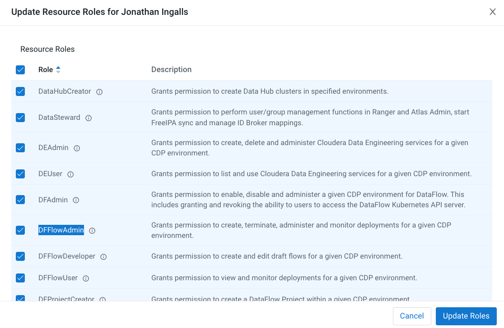

- Open **DataFlow > Catalog**.

  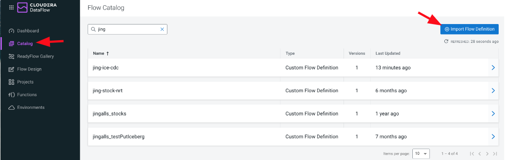

### Step 3: Import the Flow Definition

1. Click the **Import Flow Definition** button.
2. Name the flow as `"<prefix>-ice-cdc-version-1"`.
3. Upload the flow definition `.json` file.
4. Click **Import**.

  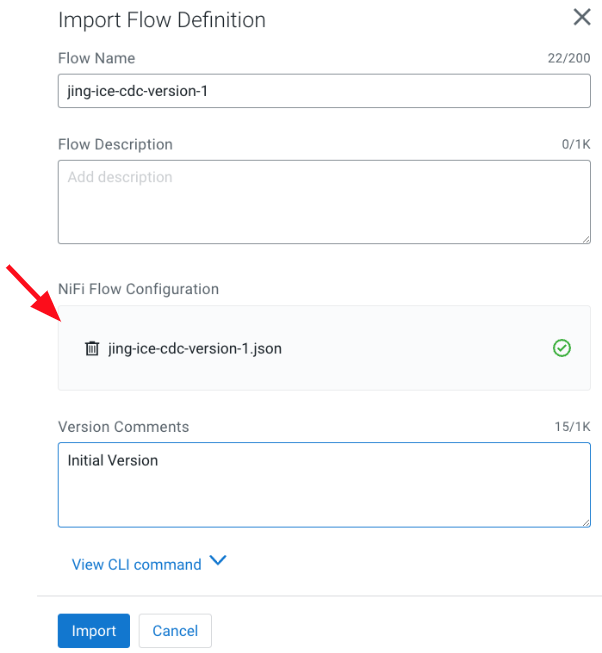

### Step 4: Create New Draft

1. Click on the flow `"<prefix>-ice-cdc"` in the Catalog to open the properties page.
2. Click **Create New Draft**.

  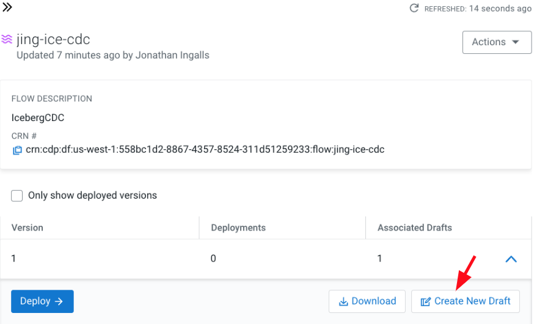

3. In **Target Workspace**, select your CDF Environment.
4. Optionally, select a **Target Project**.
5. In **Draft Name**, name the draft `"<prefix>-ice-cdc"`.
6. Click **Create**.

  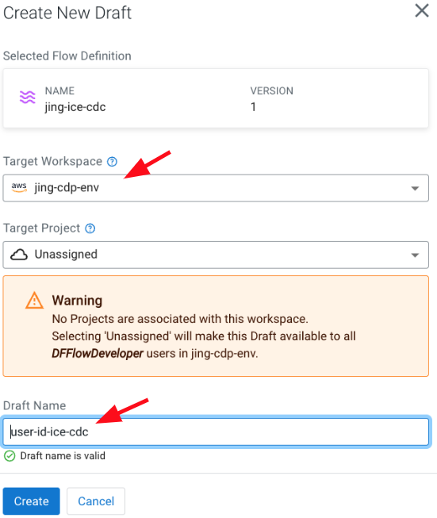

### Step 5: Modify Flow Parameters

1. Modify the following parameters in the flow:

   - **Database**: Set to `"<prefix>_airlines"`.
   - **Table Name**: The target table for applying CDC transactions.
   - **Hive Metastore URI**: The URI to the Hive Metastore, which can be found in your Data Lake settings.

     - Go to **Environment > Data Lake tab > Nodes**.
     - Copy the FQDN(s) from the Master node(s) and format as:
       - For 1 node: `thrift://<first-fqdn>:9083`
       - For 2 nodes: `thrift://<first-fqdn>:9083,thrift://<second-fqdn>:9083`

     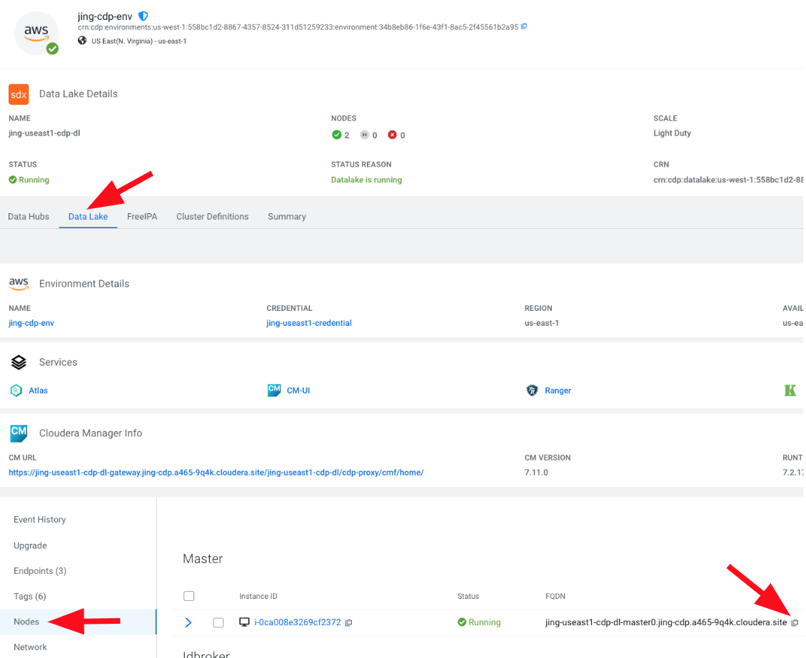

   - **Workload User**: Your CDP workload user.
   - **Workload Password**: Your CDP workload password.

  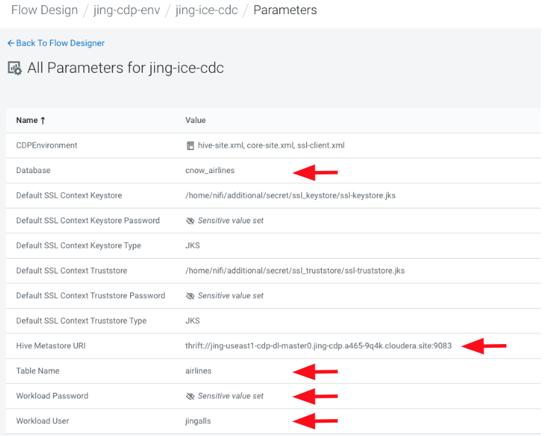

### Step 6: Start Test Session

1. Click on **Flow Options > Start Test Session**.

   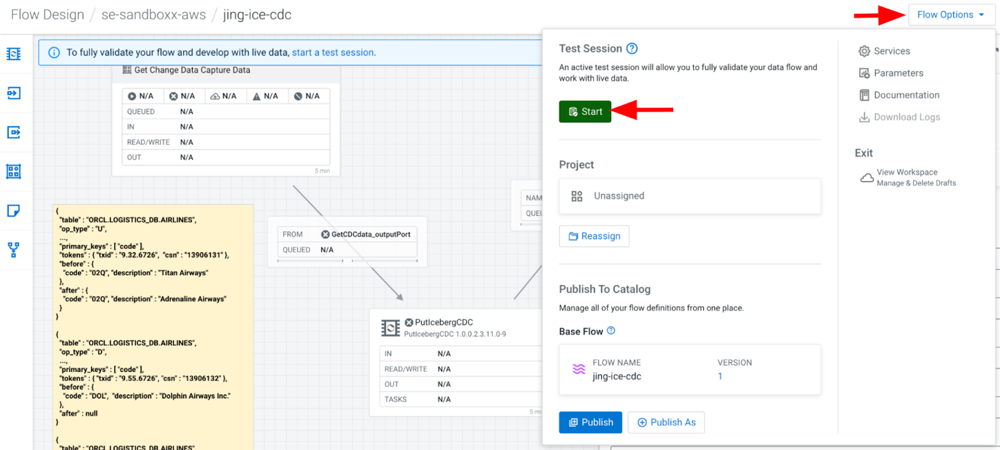

2. Click **Start Test Session**.

   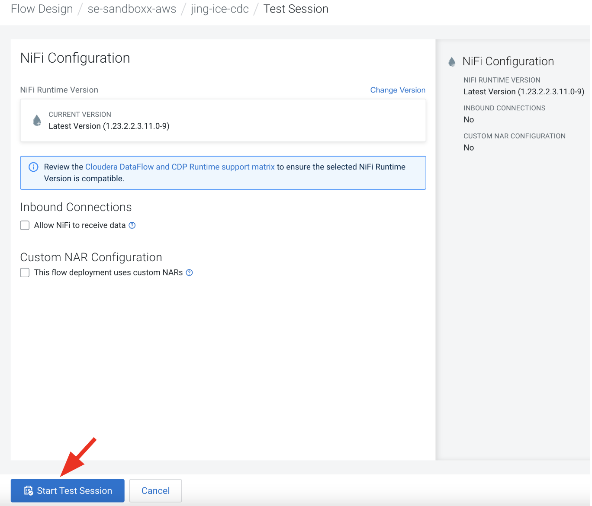

### Step 7: Enable Controller Services

1. Click **Flow Options > Services**.

   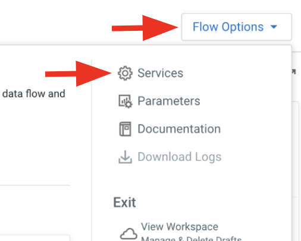

2. Enable the following services:
   - **HiveCatalogService**
   - **JsonRecordSetWriter**
   - **JsonTreeReader**
   - **KerberosPasswordUserService**

   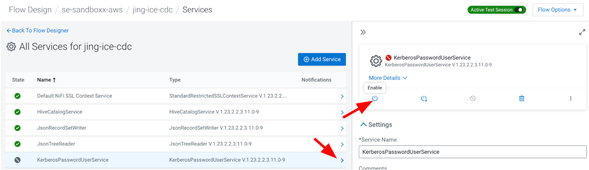

### Step 8: Run the Flow

1. In the **Get Change Data Capture Data** Processor Group:
   - Start the **ConvertRecord** Processor.
   - Start the **SplitJSON** Processor.
   - Start the **GetCDCdata_outputPort** Output Port.
   - Run the **GenerateFlowFile** Processor (Right-click and select "Run Once").

   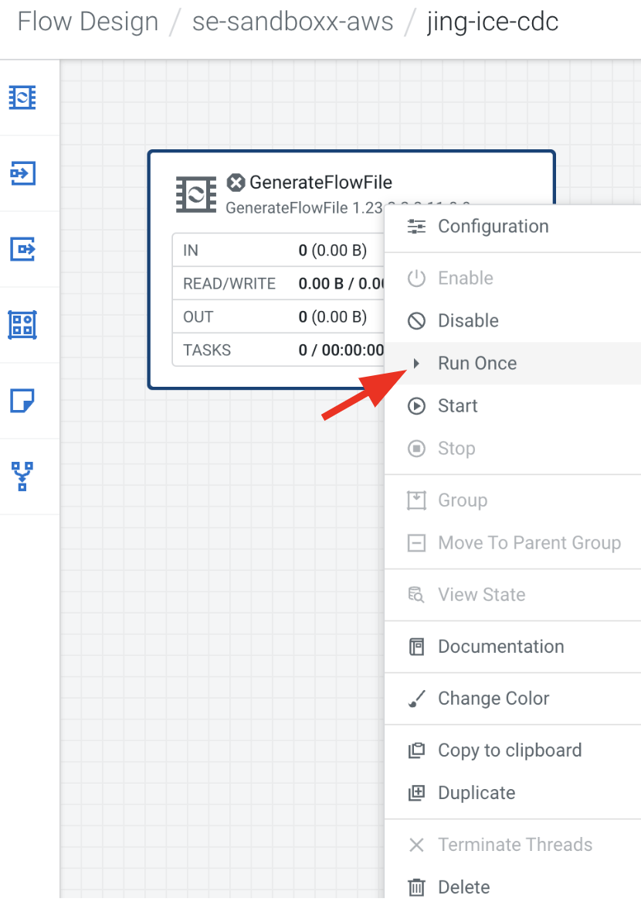

2. On the main canvas, view the generated CDC records in the Queue.
   - Right-click on the connection going into the **PutIcebergCDC** processor.
   - Click on **List Queue**.

   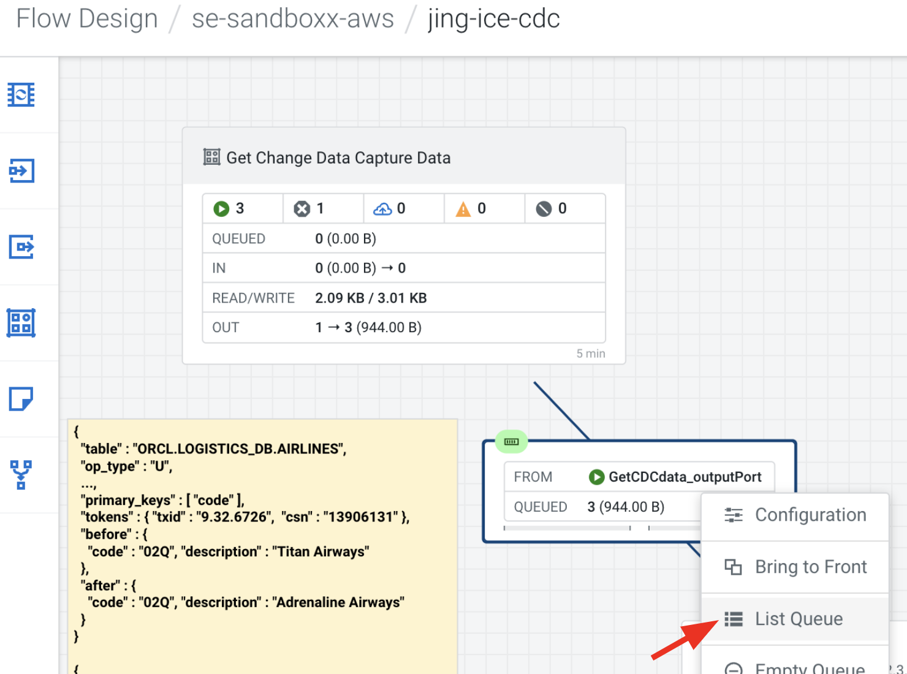

3. Select an item in the queue and click **Open in Data Viewer** to view the data.

   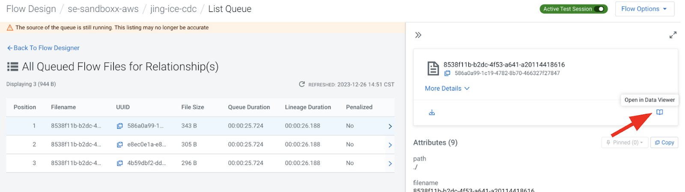

4. Start the **PutIcebergCDC** processor to send the CDC records to change the Airlines table.
   - Check the changes in **HUE** by querying the airlines table.

## Custom CDC Details

### GenerateFlowFile (Custom)

This processor simulates CDC data from any custom-built engine or third-party processor. The data for this example is formatted in a **Custom** record format.

  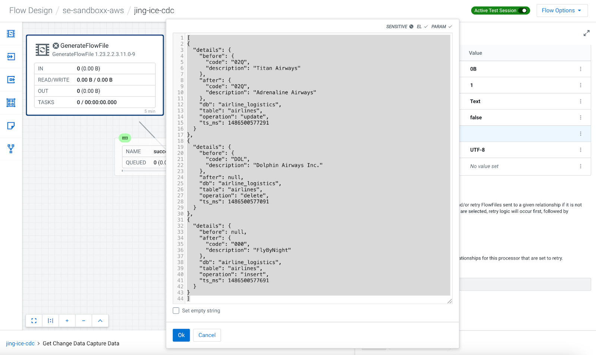

- Example of **Insert** operation record:

  ``` json
  {
    "details": {
      "before": null,
      "after": {
        "code": "000",
        "description": "FlyByNight"
      },
      "db": "airline_logistics",
      "table": "airlines",
      "operation": "insert",
      "ts_ms": 1486500577691
    }
  }
  ```

- Example of **Update** operation record:

  ``` json
  {
    "details": {
      "before": {
        "code": "02Q",
        "description": "Titan Airways"
      },
      "after": {
        "code": "02Q",
        "description": "Adrenaline Airways"
      },
      "db": "airline_logistics",
      "table": "airlines",
      "operation": "update",
      "ts_ms": 1486500577291
    }
  }
  ```

- Example of **Delete** operation record:

  ``` json
  {
    "details": {
      "before": {
        "code": "DOL",
        "description": "Dolphin Airways Inc."
      },
      "after": null,
      "db": "airline_logistics",
      "table": "airlines",
      "operation": "delete",
      "ts_ms": 1486500577091
    }
  }
  ```

### Detailed Information on PutIcebergCDC (Custom)

This processor writes CDC records to the Iceberg table using the properties defined for **Custom** record formats. You will configure paths for operation types, before/after data, and schema details.

  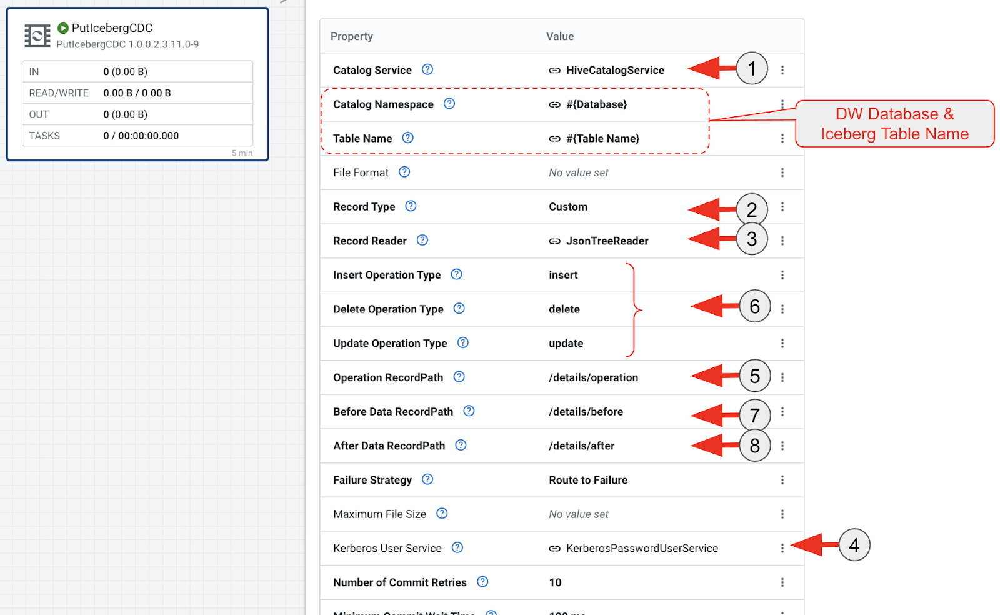

The processor uses the following key properties:

- **RecordType**: Set to **Custom**.
- **Insert, Delete, and Update Operation Types**: Define the CDC operation types found in the **Operation RecordPath**.
- **Before Data RecordPath**: Path to the record before changes.
- **After Data RecordPath**: Path to the record after changes.

## CDE - Session (run Table Compaction)

Once this flow completes, **you MUST run Table Compaction** before querying the data in the airlines table after running the **PutIcebergCDC** Processor.

Otherwise, querying the table will result in errors due to the lack of support for equality deletes at this time.

- The compaction process can be scheduled via CDE to run periodically to handle smaller files.

``` python
# SPARK CODE to compact Airlines Iceberg Table after CDC

prefix = "<prefix>"

table_name = prefix + "_airlines.airlines"

spark.sql("CALL spark_catalog.system.rewrite_data_files(table => '" + table_name + "', options => map('target-file-size-bytes','50'))").show()
```

## Summary

This submodule demonstrated how to use a **Custom CDC Data Flow** with Iceberg tables. By setting up the necessary paths for operation types, before and after data, and schema, you can process custom CDC records. The process ends with running **Table Compaction** before querying the data to avoid errors due to unsupported equality deletes.

## Next Steps

Proceed to explore other submodules or revisit previous flows (e.g., **GoldenGate CDC**) to review how different CDC engines integrate with Iceberg tables.
