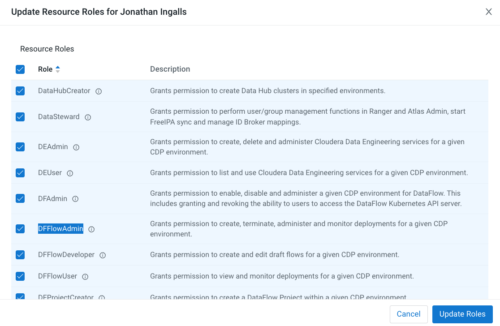
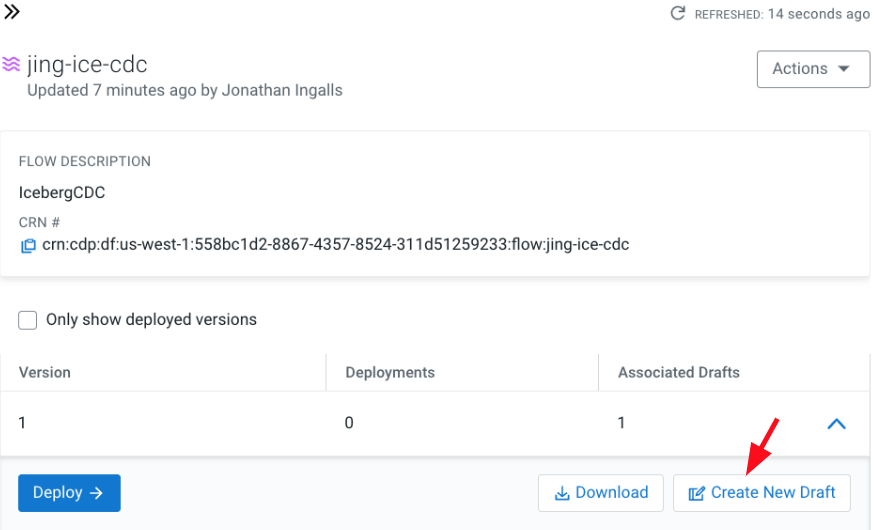
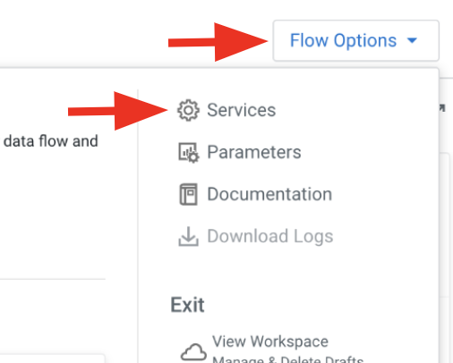
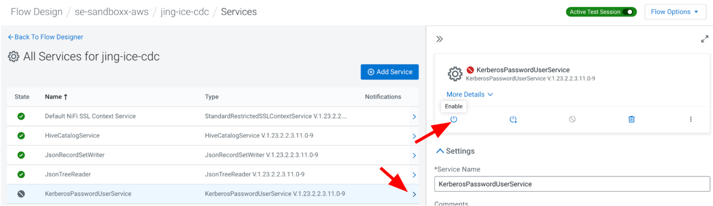
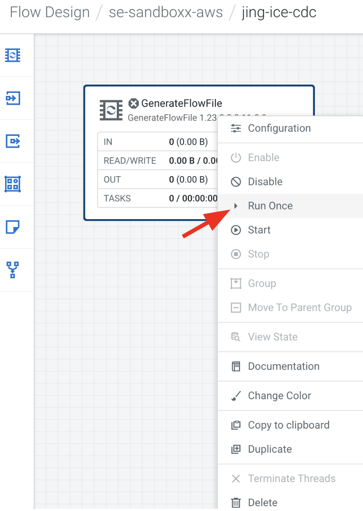

# NiFi CDC Debezium Data Flow

## Overview

In this submodule, we will simulate **Change Data Capture (CDC)** transactions using **Debezium** and the **PutIcebergCDC** processor in NiFi. This process demonstrates how to update, delete, and insert data into Iceberg tables using CDC transactions, ensuring that real-time data changes are captured accurately in your data lakehouse environment.

## Step-by-Step Guide

### Step 1: Setup

- The flow will simulate loading CDC transactions related to Airline Carrier changes.
- The flow processes an **Update**, a **Delete**, and an **Insert** into the target Iceberg table.
- The target is the `**<prefix>_airlines.airlines**` Iceberg table, which must be using **v2 Iceberg format** (`TBLPROPERTIES ("format-version"="2")`).

1. **Download the Flow Definition**
   - Download the flow definition [here](../../Assets/DataFlows/ice-cdc-version-1.json).
   - Ensure you have **DFFlowAdmin** Role for the Environment:
     

2. **Import the Flow Definition**
   - Open **DataFlow > Catalog** and click **Import Flow Definition**:
     
   - Give the flow a name like **<prefix>-ice-cdc-version-1**.
   - Upload the downloaded JSON file and click the **Import** button:
     

### Step 2: Create and Configure New Draft

1. **Create New Draft from Catalog**
   - Select the **<prefix>-ice-cdc** flow in the catalog and click **Create New Draft**:
     

2. **Define Draft Properties**
   - In the **Target Workspace**, select your **CDF Environment**.
   - Optionally select a **Target Project**.
   - Name the draft **<prefix>-ice-cdc** and click **Create**:
     

3. **Modify Flow Parameters**
   - Database: Modify to **<prefix>_airlines**.
   - Table Name: The name of the table to apply CDC transactions to (no change required).
   - Hive Metastore URI: Retrieve from your Data Lake settings:
     - Go to **Environment** > **Data Lake** > **Nodes**:
       

4. **Input your Workload User and Password**
   - **Workload User**: The CDP user ID.
   - **Workload Password**: The password for your workload user.

### Step 3: Start and Run the Flow

1. **Start Test Session**
   - Click on **Flow Options** > **Start Test Session**. This may take a few minutes to start:
     
   - Enable **all** Controller Services by navigating to **Flow Options** > **Services**:
     
   - Enable the following services:
     - **HiveCatalogService**
     - **JsonRecordSetWriter**
     - **JsonTreeReader**
     - **KerberosPasswordUserService**:
       

2. **Run the Flow**
   - Start the following processors in the "Get Change Data Capture Data" group:
     - **ConvertRecord** Processor
     - **SplitJSON** Processor
     - **GetCDCdata_outputPort** Output Port
     - **GenerateFlowFile** Processor (Right-click and select "Run Once"):
       

### Step 4: Verify CDC Transactions

1. **View CDC Records**
   - On the main canvas, view the CDC records in the queue by right-clicking on the connection going into the **PutIcebergCDC** processor and selecting **List Queue**:
     
   - Select any item in the queue and click **Open in Data Viewer**:
     

2. **Run the PutIcebergCDC Processor**
   - Start the **PutIcebergCDC** processor to apply CDC transactions to the airlines table. Verify changes by querying the table in **HUE**.

### Step 5: Detailed Information on Flow - GenerateFlowFile (Debezium)

This section simulates data coming from Debezium by using a **GenerateFlowFile** processor, focusing on writing changes to an Iceberg table. Normally, the data would come from a Kafka topic.

- The CDC records use the **Debezium** format:
  

- The **GenerateFlowFile** processor runs once per day to avoid sending large batches of records at once. Records are in JSON format and contain three main sections:
  - **Schema**: Defines the schema of the records.
  - **Payload**: Contains the actual CDC details, including the operation code (`"op": "c"`, `"u"`, `"d"` for insert, update, delete respectively).
  - **Source**: Describes the origin of the records.

Refer to the **Appendix** below for examples of the Debezium record format.

### Step 6: Table Compaction in CDE

After completing the flow, **you MUST run table compaction** before querying the table. Failing to do so will result in query errors due to lack of equality delete support.

The table compaction can be run in the background as a scheduled job in **Cloudera Data Engineering (CDE)**. The following Spark code will compact the **airlines** table after CDC:

``` python 
# SPARK CODE to compact Airlines Iceberg Table after CDC
prefix = "<prefix>"
table_name = prefix + "_airlines.airlines"
spark.sql("CALL spark_catalog.system.rewrite_data_files(table => '" + table_name + "', options => map('target-file-size-bytes','50'))").show()
```

## Summary

In this submodule, we simulated **Change Data Capture (CDC)** transactions using the **Debezium** format in **NiFi**. We configured the flow to update, delete, and insert data into an Iceberg table. Additionally, we ran a **Table Compaction** process to ensure queries against the modified table run correctly.

## Appendix

### CDC Record Examples (Debezium Format)

1. **Insert Operation** (`"op": "c"`): Inserts a new record into the table.

``` json
{
  "schema": {
    "type": "struct",
    "fields": [
      { "type": "string", "field": "code" },
      { "type": "string", "field": "description" }
    ]
  },
  "payload": {
    "before": null,
    "after": {
      "code": "000",
      "description": "FlyByNight"
    },
    "op": "c"
  }
}
```

2. **Update Operation** (`"op": "u"`): Updates an existing record in the table.

``` json
{
  "schema": {
    "type": "struct",
    "fields": [
      { "type": "string", "field": "code" },
      { "type": "string", "field": "description" }
    ]
  },
  "payload": {
    "before": {
      "code": "02Q",
      "description": "Titan Airways"
    },
    "after": {
      "code": "02Q",
      "description": "Adrenaline Airways"
    },
    "op": "u"
  }
}
```

3. **Delete Operation** (`"op": "d"`): Deletes a record from the table.

``` json
{
  "schema": {
    "type": "struct",
    "fields": [
      { "type": "string", "field": "code" },
      { "type": "string", "field": "description" }
    ]
  },
  "payload": {
    "before": {
      "code": "DOL",
      "description": "Dolphin Airways Inc."
    },
    "after": null,
    "op": "d"
  }
}
```

## Next Steps

Proceed to the next submodule: [CDC GoldenGate Data Flow](change_data_capture_goldengate_DF.md).
