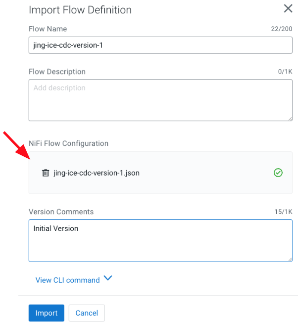
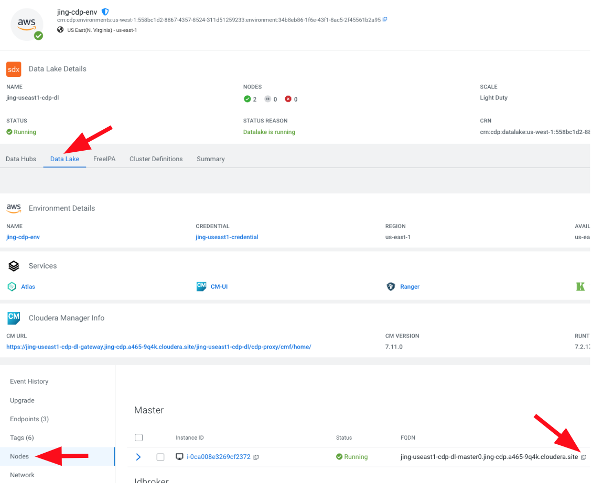
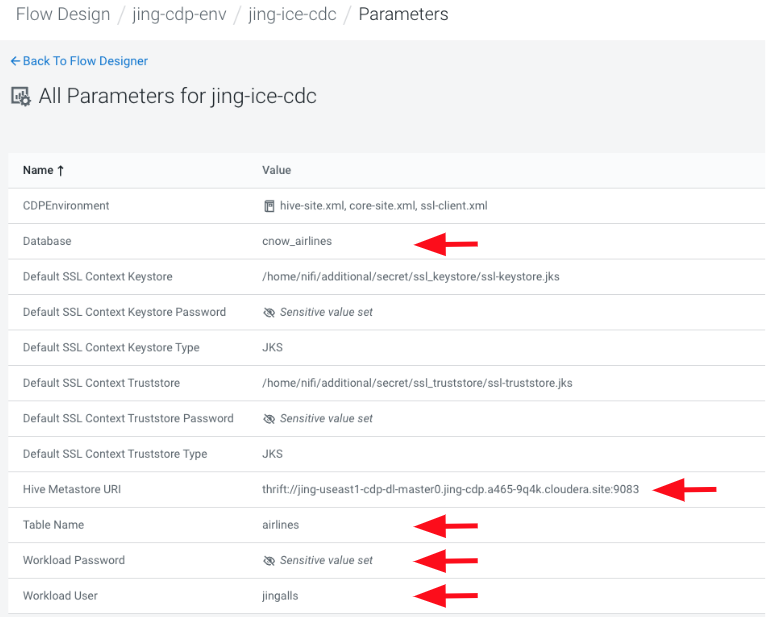
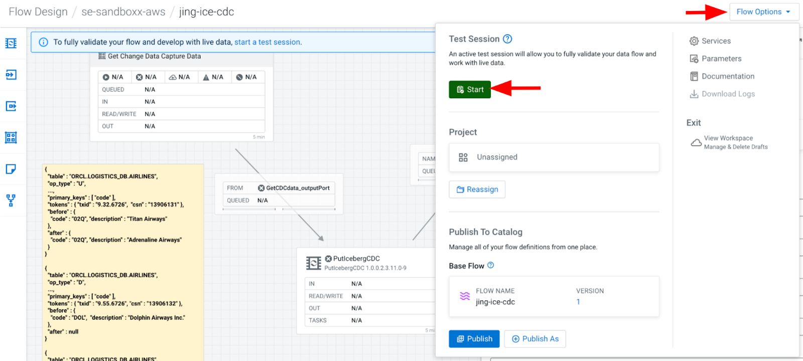
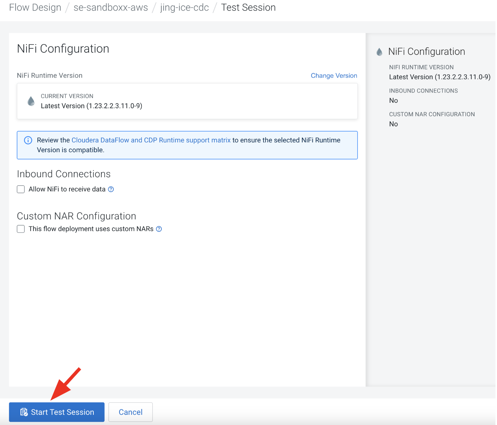
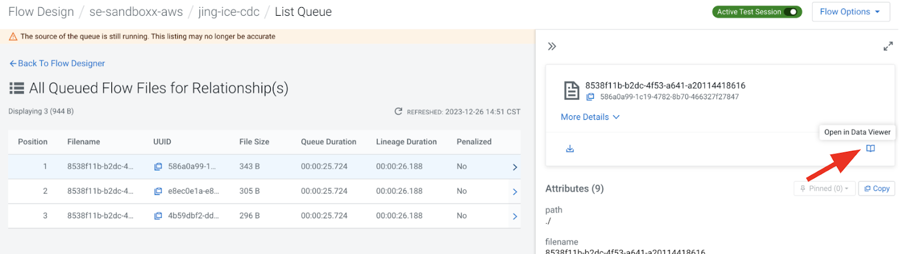

# CDC GoldenGate Data Flow

## Overview

In this submodule, we explore the use of **GoldenGate** for simulating **Change Data Capture (CDC)** transactions into Iceberg tables. This flow simulates inserting, updating, and deleting records related to Airline Carrier changes. It ensures proper CDC transactions and data is loaded accurately into the Iceberg table. Note that a **Table Compaction** must be run before querying the table after the CDC transactions have been processed.

## Step-by-Step Guide

### Step 1: Setup the Flow Definition

Download the flow definition [here](../../Assets/DataFlows/ice-cdc-version-1.json).

### Step 2: Prerequisite Steps

- Ensure you have the **DFFlowAdmin Role** for the environment.
  
  

- Open **DataFlow > Catalog**.

  

### Step 3: Import the Flow Definition

1. Click the **Import Flow Definition** button.
2. Name the flow as `"<prefix>-ice-cdc-version-1"`.
3. Upload the flow definition `.json` file.
4. Click **Import**.

  

### Step 4: Create New Draft

1. Click on the flow `"<prefix>-ice-cdc"` in the Catalog to open the properties page.
2. Click **Create New Draft**.
  
  

3. In **Target Workspace**, select your CDF Environment.
4. Optionally, select a **Target Project**.
5. In **Draft Name**, name the draft `"<prefix>-ice-cdc"`.
6. Click **Create**.

  

### Step 5: Modify Flow Parameters

1. Modify the following parameters in the flow:

   - **Database**: Set to `"<prefix>_airlines"`.
   - **Table Name**: The target table for applying CDC transactions.
   - **Hive Metastore URI**: The URI to the Hive Metastore, which can be found in your Data Lake settings.

     - Go to **Environment > Data Lake tab > Nodes**.
     - Copy the FQDN(s) from the Master node(s) and format as:
       - For 1 node: `thrift://<first-fqdn>:9083`
       - For 2 nodes: `thrift://<first-fqdn>:9083,thrift://<second-fqdn>:9083`

     

   - **Workload User**: Your CDP workload user.
   - **Workload Password**: Your CDP workload password.

  

### Step 6: Start Test Session

1. Click on **Flow Options > Start Test Session**.
   
   

2. Click **Start Test Session**.

   

### Step 7: Enable Controller Services

1. Click **Flow Options > Services**.
   
   

2. Enable the following services:
   - **HiveCatalogService**
   - **JsonRecordSetWriter**
   - **JsonTreeReader**
   - **KerberosPasswordUserService**

   

### Step 8: Run the Flow

1. In the **Get Change Data Capture Data** Processor Group:
   - Start the **ConvertRecord** Processor.
   - Start the **SplitJSON** Processor.
   - Start the **GetCDCdata_outputPort** Output Port.
   - Run the **GenerateFlowFile** Processor (Right-click and select "Run Once").

   

2. On the main canvas, view the generated CDC records in the Queue.
   - Right-click on the connection going into the **PutIcebergCDC** processor.
   - Click on **List Queue**.

   

3. Select an item in the queue and click **Open in Data Viewer** to view the data.

   

4. Start the **PutIcebergCDC** processor to send the CDC records to change the Airlines table.
   - Check the changes in **HUE** by querying the airlines table.

## GoldenGate Details

### GenerateFlowFile (GoldenGate)

This processor simulates CDC data from GoldenGate. Normally, CDC data would come from a Kafka topic.

  

- The CDC records will use the **GoldenGate** format.

- JSON representation of the CDC record types:
  - **Insert** record example:

  ``` json
  {
    "table": "ORCL.LOGISTICS_DB.AIRLINES",
    "op_type": "I",
    "before": null,
    "after": {
      "code": "000",
      "description": "FlyByNight"
    }
  }
  ```

  - **Update** record example:

  ``` json 
  {
    "table": "ORCL.LOGISTICS_DB.AIRLINES",
    "op_type": "U",
    "before": {
      "code": "02Q",
      "description": "Titan Airways"
    },
    "after": {
      "code": "02Q",
      "description": "Adrenaline Airways"
    }
  }
  ```

  - **Delete** record example:

  ``` json
  {
    "table": "ORCL.LOGISTICS_DB.AIRLINES",
    "op_type": "D",
    "before": {
      "code": "DOL",
      "description": "Dolphin Airways Inc."
    },
    "after": null
  }
  ```

## Detailed Information on PutIcebergCDC Processor (GoldenGate)

- The **PutIcebergCDC** processor updates, inserts, and deletes records in the Iceberg table.
- File format is defined by the **write.format.default** property, defaulting to **PARQUET**.

- The Iceberg table will be identified by the **Catalog Namespace** and **Table Name** properties:
   - **Catalog Namespace** is equivalent to the database name in the Data Lakehouse.
   - **Table Name** is the name of the Iceberg table.

- These properties are parameterized to allow for changes across different environments.

## CDE - Session (run Table Compaction)

Once this flow completes, **you MUST run Table Compaction** before querying the data in the airlines table after running the **PutIcebergCDC** Processor.

Otherwise, querying the table will result in errors due to the lack of support for equality deletes at this time.

- The compaction process can be scheduled via CDE to run periodically to handle smaller files.
  
``` python
# SPARK CODE to compact Airlines Iceberg Table after CDC

prefix = "<prefix>"

table_name = prefix + "_airlines.airlines"

spark.sql("CALL spark_catalog.system.rewrite_data_files(table => '" + table_name + "', options => map('target-file-size-bytes','50'))").show()
```

## Summary

This submodule demonstrated how to use **GoldenGate** to simulate Change Data Capture (CDC) transactions within Iceberg tables. The flow processes updates, inserts, and deletes, but you must run a **Table Compaction** process before querying the data to avoid errors due to equality deletes not being supported yet.

## Next Steps

Proceed to the [next submodule](change_data_capture_custom_DF.md), where we will explore a **Custom CDC Data Flow**, or revisit the **Debezium** submodule if you need to review Debezium-based CDC transactions.
