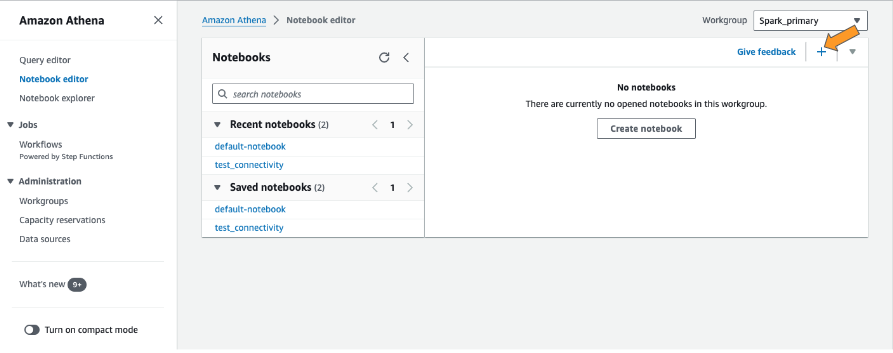
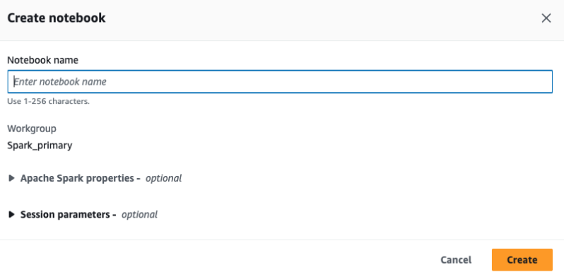
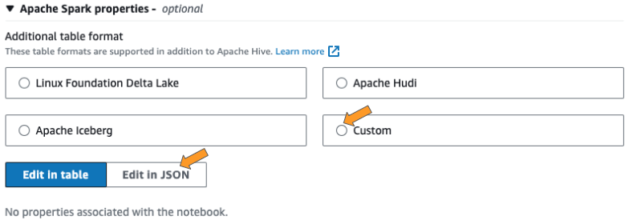
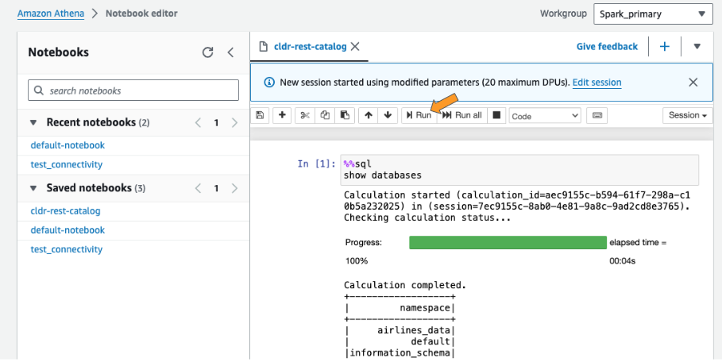
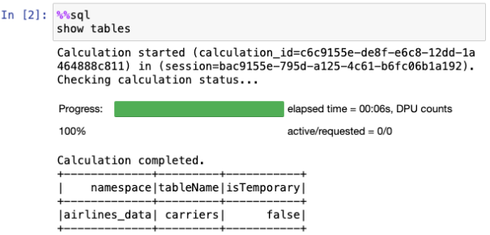
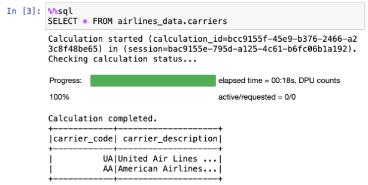
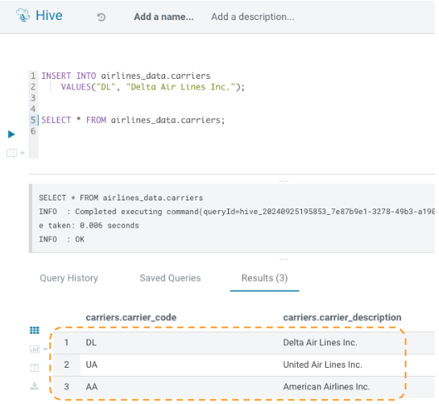
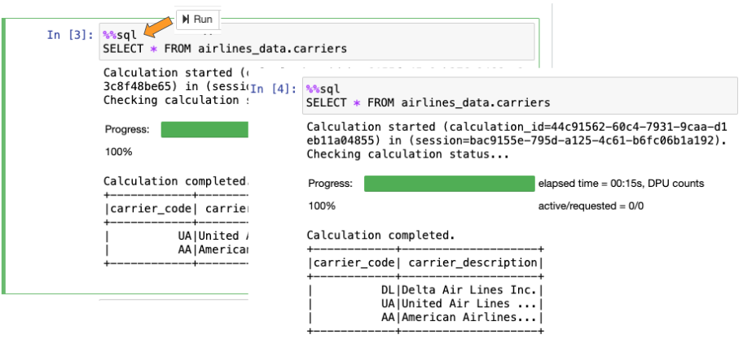
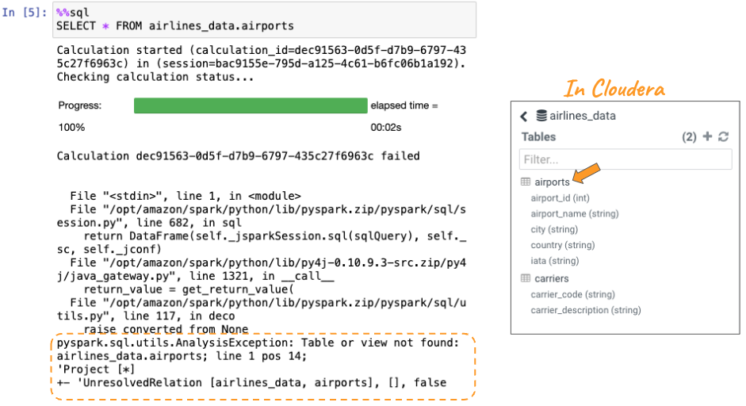

# REST Catalog - Amazon Athena

The Iceberg REST Catalog enables users to interact with Iceberg tables using a standardized REST API, making the catalog more accessible, scalable, and flexible for cloud-native and distributed architectures.

In this module you will learn how to setup Amazon Athena to connect to the Cloudera Iceberg REST Catalog.

**Amazon Athena Create New Notebook**

- Create a New Athena Notebook - click on the "+" button on the top right.


   - Give the Notebook a name "\<prefix>-cldr-ice-rest".  Replace \<prefix> with the prefix you have been using.


   - Click on "Custom" and "Edit in JSON"


   - Copy/paste the following in the JSON Editor:

```
{
    "spark.sql.catalog.demo": "org.apache.iceberg.spark.SparkCatalog",
    "spark.sql.catalog.demo.credential": "<Client-ID>:<Client-Secret>",
    "spark.sql.catalog.demo.default-namespace": "<database>",
    "spark.sql.catalog.demo.type": "rest",
    "spark.sql.catalog.demo.uri": "https://<CDP-knox-gateway>/cdp-share-access/hms-api/icecli",
    "spark.sql.defaultCatalog": "demo",
    "spark.sql.extensions": "org.apache.iceberg.spark.extensions.IcebergSparkSessionExtensions"
}
```

   - Replace **\<Client-ID>**, and **\<Client-Secret>** with these values provided by the "knoxshare.sh" script you ran previously

   - Replace **\<CDP-knox-gateway>** with your user id.  Once completed click on “Create and Run” button

   - Replace **\<database>** with your database.

   - Example:
      - {
       "spark.sql.catalog.demo": "org.apache.iceberg.spark.SparkCatalog",
       "spark.sql.catalog.demo.credential": "78eazzz1-088a-4781-9ad7-a9cd445a090e:TnpobFlXVmxaVEV0TURnNFlTMDBOemd4TFRxyFpEY3RZVGxrWXpRME5XRXdPVEJsOjpOR1V6TnpVd1ltWXRObVpqWWkwME5UZ3hMVGswTUdVdE5XTTBPRFV4TURJNE1HUmw=",
       "spark.sql.catalog.demo.default-namespace": "rest_airlines_db",
       "spark.sql.catalog.demo.type": "rest",
       "spark.sql.catalog.demo.uri": "https://demo-aws-dl-gateway.demo-aws.a465-9q4k.cloudera.site/demo-aws-dl/cdp-share-access/hms-api/icecli",
       "spark.sql.defaultCatalog": "demo",
       "spark.sql.extensions": "org.apache.iceberg.spark.extensions.IcebergSparkSessionExtensions"
      }

**Amazon Athena Notebook Code to Access Cloudera Iceberg Tables**

- In the first cell copy/paste the following and then ">| RUN" the cell.

```
%%sql
show databases
```



- Add a new cell (click "+" button in Session toolbar)
   - In the cell copy/paste the following and then ">| RUN" the cell.

```
%%sql
show tables
```



- **Query Cloudera Iceberg Table:** Add a new cell (click "+" button in Session toolbar)
   - In the cell copy/paste the following and then ">| RUN" the cell.

```
%%sql
SELECT * FROM airlines_data.carriers
```




- **Insert new Record into Cloudera Iceberg Table:** Add a new record into the Airlines table in Hive VW


- **Query Cloudera Iceberg Table, after adding new carrier:** Rerun the cell
   - Select cell again by clicking into the cell and then ">| RUN" the cell.



- **Query Cloudera Iceberg Table with no right to read the table:** Add a new cell (click "+" button in Session toolbar)
   - In the cell copy/paste the following and then ">| RUN" the cell.

```
%%sql
SELECT * FROM airlines_data.airports
```



                                      