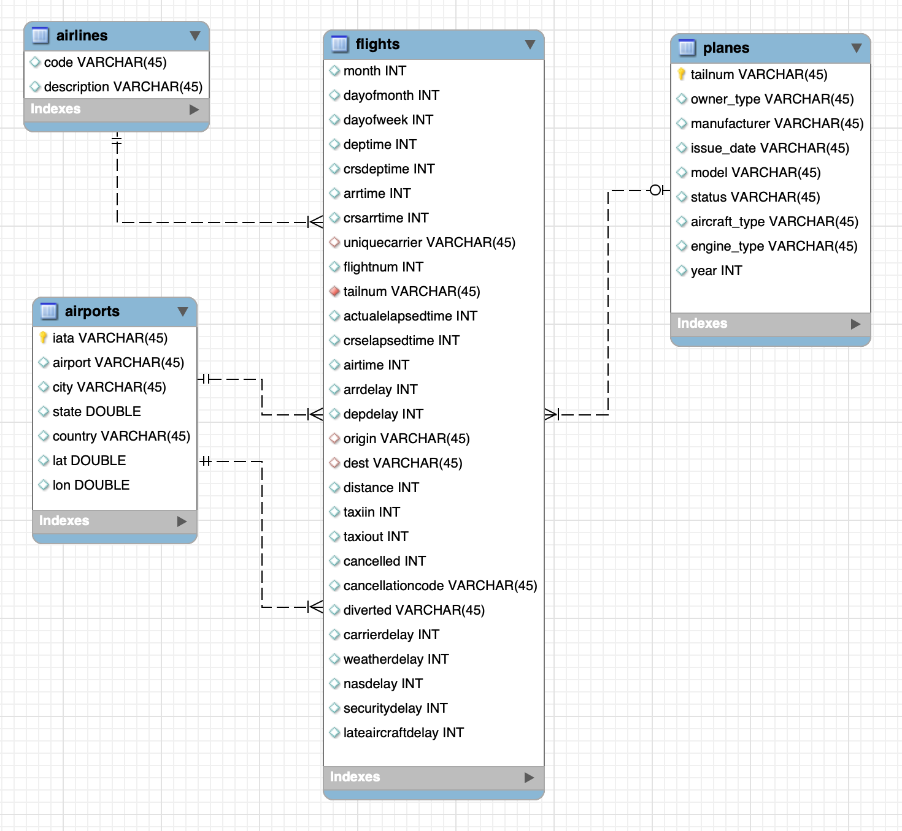

# iceberg-demo-runbook README

## Iceberg Demo Runbook
### Iceberg - CDP’s Open Data Lakehouse

## Summary

This is meant to showcase the end-to-end capabilities of the Cloudera Data Platform (CDP) Open Data Lakehouse powered by Apache Iceberg.  It includes multi-function analytics covering
   * **Ingest** - batch/streaming
   * **Enrich** - data engineering, transformations, data wrangling
   * **Store the Data** - in a Data Lakehouse (Iceberg)
   * **Predict** - machine learning, artificial intelligence

**Value Propositions**

Take advantage of Iceberg - CDP’s Open Data Lakehouse, to experience better performance, lower maintenance responsibilities, and greater control.

**Scenario**

Working for an "Aircraft Engine Manufacturer" company that wants to increase competitive advantage in two key ways:
   * Engineer better, more fault tolerant aircraft engines
   * Be proactive in predictive maintenance on engines, and faster discovery-to-fix in new engine designs

This will be a three phase plan:
  1. Phase one:  Understand how our current engines contribute to airline flight delays and fix for future engines
  2. Phase two:  Implement an ongoing reporting service to support ongoing engineering efforts to continuously improve engines based on delay data
  3. Phase three:  Move to real-time analysis to fix things before they break both in engines already sold, and in new engine designs.

**Setup**

To do this, let's build a data warehouse & data lakehouse to create reports that engineers can use to improve our engines.  The following people will get to work:

   * **Warehouse Administrators:**  These folks need to set up, monitor and maintain the data warehouse infrastructure, ensure security and governance is met, and support the BI Analysts and end user communities.

   * **BI Analysts:**  These folks will wrangle the needed data, keep the data up to date, tweak the data for quality and consistency, develop robust and perfromant curated data sets and build rich visual reports.

   * **End user community:**  the 1,000+ aircraft mechanical and electrical engineers that will use the insight to improve design and provide preventative maintenance guidance to existing engines.

To improve our engine quality, we need to know three things:
   1. Which engines are related to the most airline delays, and why?  This will help us improve engine efficiency (get there on time), reliability (reduce mechanical failures) and dependability (remove factors like weather that may impact engine performance).
   2. Which airlines are using our engines and why?  This will help us prioritize our efforts
   3. Which engines are continuously causing more challenges in the field - and why?  This will give us real-time feedback that can lead to better customer service (proactive maintenance and modifications to reduce challenges) and better next-generation engines (just-in-time feedback to engineers to modify prototypes and production units before they are shipped to the next customers)

**Introduction**

For this scenario, we will show how Cloudera Data Platform (CDP) is used to enable the "Aircraft Engine Manufacturer" to gain competitive advantage - and at the same time it highlights the performance and automation capabilities that help ensure performance is maintained while controlling costs.

The following instructions will take you through how to use the Cloudera Data Platform (CDP) to quickly explore raw data, create curated versions of the data for simple reporting and dashboarding, and then scale up usage of the curated data by exposing it to more users.
   * 00(00_prereqs.md) - UNDERSTAND THE PRE-REQS
   * 01(01_setup.md) - GET IT SET UP
   * 02(02_data_lakehouse.md) - MAKING IT BETTER
   * 03(03_enrich.md) - OPTIMIZING FOR PRODUCTION
   * 04(04_ingest.md) - ADDING REAL TIME DATA
   * 05(05_predict.md) -  PREDICTIVE

**ER Diagram:**

   * Fact table: flights (86M rows)
   * Dimension tables: airlines (1.5k rows), airports (3.3k rows) and planes (5k rows)

