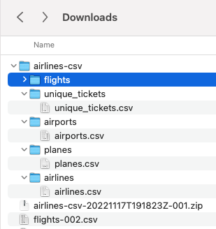
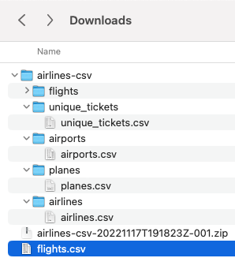
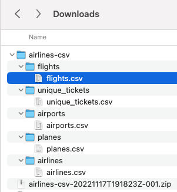
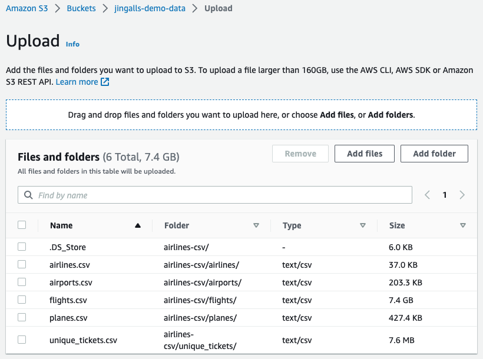
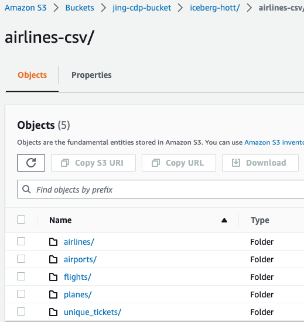

# Demo Install/Setup

**Sandbox Tenant**

**Environment:** se-sandboxx-aws \<OR> create your own


## CDP Environment<a id="cdp-environment"></a>

- **REQUIRED:** you must have access to the S3 bucket for whatever CDP Environment you plan to use

- You have two (2) options

1. Use an existing CDP Environment in the Sandbox Tenant, such as se-sandboxx-aws

2. Create your own CDP Environment \[for screenshots in this Runbook, this is the route that was used]


## Getting Airline Data to Cloud Storage<a id="getting-airline-data-to-cloud-storage"></a>

- Download files from Google Drive in this [folder](https://drive.google.com/drive/folders/1y0bHTrco4qiFBozEbnoCsD2vG19htRWS?usp=share_link)

  - Click on the drop down next to folder, and select Download


- This will create a zip file and downloads 2 files


- Unzip the downloaded zip file


- In the airlines-csv directory, create a New Directory named “flights”



- Rename the flights-002.csv file to “flights.csv”



- Move flights.csv file to the airlines-csv/flights directory



- In the AWS Console for s3 

  - Navigate to the bucket used for creating the environment


- Create a folder named - iceberg-hott

  - This new folder location should be something like “s3a://\<cdp-bucket>/iceberg-hott”

- \[In AWS S3, Upload] With the folder you just created selected, click on Upload, on the Upload screen click “Add folder” button and browse your computer to the  airlines-csv directory (download from Google Drive)



- Browse each of the folder to make sure the CSV file in the folders - flights, planes, airlines, and airports

 >>


## Create CDW Virtual Warehouses<a id="create-cdw-virtual-warehouses"></a>

- In CDW ensure that the Environment you are using is enabled for use with CDW

  - For this Runbook you can use the Default Database Catalog that is automatically created with enabling CDW for the Environment

- Create two CDW Virtual Warehouses attached to the Default Database Catalog, replace \<user-id> with your user id

  - Create a Hive VW

    - Name: “**\<user-id>**-iceberg-hive-vw”

    - Type: Hive

    - Database Catalog: select the Default DBC for the Environment you are using

    - Size: x-small

    - Concurrency Autoscaling > Executors: make sure the max is > (# Attendees \* 2)

    - Leave remaining options as default (these can be changed but for this Runbook there are no specific settings that are required)

  - Create an Impala VW

    - Name: “**\<user-id>**-iceberg-impala-vw”

    - Type: Impala

    - Database Catalog: select the Default DBC for the Environment you are using

    - Size: x-small

    - Unified Analytics: enabled

    - Executors: make sure the max is > (# Attendees \* 2)

    - Leave remaining options as default (these can be changed but for this Runbook there are no specific settings that are required)


## Setting up the Databases for the Demo<a id="setting-up-the-databases-for-the-demo"></a>

- Execute the following in HUE using the Hive VW named **\<user-id>-iceberg-hive-vw**

  - Copy & paste the SQL (`in gray`) below

    - HUE has determined that there are 2 parameters that need to be entered, in the “user\_id” box enter your user id; and in the “cdp\_env\_bucket” box enter the CDP Environment bucket name


```
    -- CREATE DATABASES
    CREATE DATABASE ${user_id}_airlines_csv;
    CREATE DATABASE ${user_id}_airlines;
    CREATE DATABASE ${user_id}_airlines_maint;

    -- CREATE CSV TABLES
    drop table if exists ${user_id}_airlines_csv.flights_csv;

    CREATE EXTERNAL TABLE ${user_id}_airlines_csv.flights_csv (month int, dayofmonth int, dayofweek int, deptime int, crsdeptime int, arrtime int, crsarrtime int, uniquecarrier string, flightnum int, tailnum string, actualelapsedtime int, crselapsedtime int, airtime int, arrdelay int, depdelay int, origin string, dest string, distance int, taxiin int, taxiout int, cancelled int, cancellationcode string, diverted string, carrierdelay int, weatherdelay int, nasdelay int, securitydelay int, lateaircraftdelay int, year int)
    ROW FORMAT DELIMITED FIELDS TERMINATED BY ',' LINES TERMINATED BY '\n'
    STORED AS TEXTFILE LOCATION 's3a://${cdp_env_bucket}/airlines-csv/flights' tblproperties("skip.header.line.count"="1");

    drop table if exists ${user_id}_airlines_csv.planes_csv;

    CREATE EXTERNAL TABLE ${user_id}_airlines_csv.planes_csv (tailnum string, owner_type string, manufacturer string, issue_date string, model string, status string, aircraft_type string, engine_type string, year int)
    ROW FORMAT DELIMITED FIELDS TERMINATED BY ',' LINES TERMINATED BY '\n'
    STORED AS TEXTFILE LOCATION 's3a://${cdp_env_bucket}/airlines-csv/planes' tblproperties("skip.header.line.count"="1");

    drop table if exists ${user_id}_airlines_csv.airlines_csv;

    CREATE EXTERNAL TABLE ${user_id}_airlines_csv.airlines_csv (code string, description string) 
    ROW FORMAT DELIMITED FIELDS TERMINATED BY ',' LINES TERMINATED BY '\n'
    STORED AS TEXTFILE LOCATION 's3a://${cdp_env_bucket}/airlines-csv/airlines/' tblproperties("skip.header.line.count"="1");

    drop table if exists ${user_id}_airlines_csv. airports_csv;

    CREATE EXTERNAL TABLE ${user_id}_airlines_csv.airports_csv (iata string, airport string, city string, state DOUBLE, country string, lat DOUBLE, lon DOUBLE)
    ROW FORMAT DELIMITED FIELDS TERMINATED BY ',' LINES TERMINATED BY '\n'
    STORED AS TEXTFILE LOCATION 's3a://${cdp_env_bucket}/airlines-csv/airports' tblproperties("skip.header.line.count"="1");

    drop table if exists ${user_id}_airlines_csv.unique_tickets_csv;

    CREATE external TABLE ${user_id}_airlines_csv.unique_tickets_csv (ticketnumber BIGINT, leg1flightnum BIGINT, leg1uniquecarrier STRING, leg1origin STRING,   leg1dest STRING, leg1month BIGINT, leg1dayofmonth BIGINT,   
     leg1dayofweek BIGINT, leg1deptime BIGINT, leg1arrtime BIGINT,   
     leg2flightnum BIGINT, leg2uniquecarrier STRING, leg2origin STRING,   
     leg2dest STRING, leg2month BIGINT, leg2dayofmonth BIGINT,   leg2dayofweek BIGINT, leg2deptime BIGINT, leg2arrtime BIGINT ) 
    ROW FORMAT DELIMITED FIELDS TERMINATED BY ',' LINES TERMINATED BY '\n' 
    STORED AS TEXTFILE LOCATION 's3a://${cdp_env_bucket}/airlines-csv/unique_tickets' 
    tblproperties("skip.header.line.count"="1");

    -- CREATE HIVE TABLE FORMAT STORED AS PARQUET
    drop table if exists ${user_id}_airlines.planes;

    CREATE EXTERNAL TABLE ${user_id}_airlines.planes (
      tailnum STRING, owner_type STRING, manufacturer STRING, issue_date STRING,
      model STRING, status STRING, aircraft_type STRING,  engine_type STRING, year INT 
    ) 
    STORED AS PARQUET
    ;

    INSERT INTO ${user_id}_airlines.planes
      SELECT * FROM ${user_id}_airlines_csv.planes_csv;

    drop table if exists ${user_id}_airlines.unique_tickets;

    CREATE EXTERNAL TABLE ${user_id}_airlines.unique_tickets (
      ticketnumber BIGINT, leg1flightnum BIGINT, leg1uniquecarrier STRING,
      leg1origin STRING,   leg1dest STRING, leg1month BIGINT,
      leg1dayofmonth BIGINT, leg1dayofweek BIGINT, leg1deptime BIGINT,
      leg1arrtime BIGINT, leg2flightnum BIGINT, leg2uniquecarrier STRING,
      leg2origin STRING, leg2dest STRING, leg2month BIGINT, leg2dayofmonth BIGINT,
      leg2dayofweek BIGINT, leg2deptime BIGINT, leg2arrtime BIGINT 
    ) 
    STORED AS PARQUET
    TBLPROPERTIES ('external.table.purge'='true');

    INSERT INTO ${user_id}_airlines.unique_tickets
      SELECT * FROM ${user_id}_airlines_csv.unique_tickets_csv;

    -- CREATE ICEBERG TABLE FORMAT STORED AS PARQUET
    drop table if exists ${user_id}_airlines.flights_iceberg;

    CREATE EXTERNAL TABLE ${user_id}_airlines.flights_iceberg (
     month int, dayofmonth int, 
     dayofweek int, deptime int, crsdeptime int, arrtime int, 
     crsarrtime int, uniquecarrier string, flightnum int, tailnum string, 
     actualelapsedtime int, crselapsedtime int, airtime int, arrdelay int, 
     depdelay int, origin string, dest string, distance int, taxiin int, 
     taxiout int, cancelled int, cancellationcode string, diverted string, 
     carrierdelay int, weatherdelay int, nasdelay int, securitydelay int, 
     lateaircraftdelay int
    ) 
    PARTITIONED BY (year int)
    STORED BY ICEBERG 
    STORED AS PARQUET
    ;

    -- LOAD DATA INTO ICEBERG TABLE FORMAT STORED AS PARQUET
    INSERT INTO ${user_id}_airlines.flights_iceberg
     SELECT * FROM ${user_id}_airlines_csv.flights_csv
     WHERE year <= 2006;

    -- [TABLE MAINTENANCE] CREATE FLIGHTS TABLE IN ICEBERG TABLE FORMAT STORED AS PARQUET
    drop table if exists ${user_id}_airlines_maint.flights;

    CREATE TABLE ${user_id}_airlines_maint.flights (
     month int, dayofmonth int, 
     dayofweek int, deptime int, crsdeptime int, arrtime int, 
     crsarrtime int, uniquecarrier string, flightnum int, tailnum string, 
     actualelapsedtime int, crselapsedtime int, airtime int, arrdelay int, 
     depdelay int, origin string, dest string, distance int, taxiin int, 
     taxiout int, cancelled int, cancellationcode string, diverted string, 
     carrierdelay int, weatherdelay int, nasdelay int, securitydelay int, 
     lateaircraftdelay int
    ) 
    PARTITIONED BY (year int)
    STORED BY ICEBERG 
    STORED AS PARQUET
    ;
```

- Execute the following in HUE using the Hive VW to test that data has loaded correctly

  - Copy & paste the SQL below into HUE, in the “user\_id” parameter box enter your user id

```
-- TEST FLIGHTS CSV TABLE
SELECT COUNT(*) FROM ${user_id}_airlines_csv.flights_csv;
```

Ensure that correct count is being returned

- Copy & paste the SQL below into HUE, in the “user\_id” parameter box enter your user id

```
-- TEST PLANES CSV TABLE
SELECT COUNT(*) FROM ${user_id}_airlines_csv.planes_csv;
```

- Copy & paste the SQL below into HUE, in the “user\_id” parameter box enter your user id

```
-- TEST PLANES PROPERTIES
DESCRIBE FORMATTED ${user_id}_airlines.planes;
```

Pay attention to the following properties: Table Type, SerDe Library, and Location

- Copy & paste the SQL below into HUE, in the “user\_id” parameter box enter your user id

```
-- TEST PLANES PARQUET TABLE
SELECT * FROM ${user_id}_airlines.planes LIMIT 10;
```

Ensure records are being returned, tailnum should not be null, but other columns are empty or null
